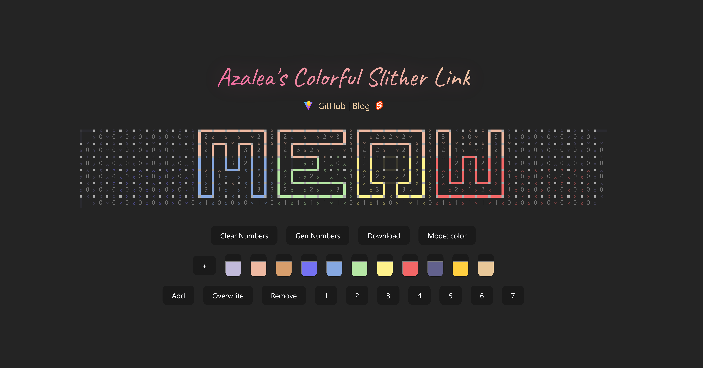

TODO: Remember to add a description meow

## Creating Puzzles

You're interested in creating puzzles? Great! Here's how you can do it:

**Step 1: Create the board**

Go to the [editor](https://slither.hydev.org/?edit=1&size=10). The editor has three basic modes: line, mask, and color. You can set the board size by changing the size parameter in the URL.

You can use checkpointing to save your step-by-step progress. The auto-saving feature will also work for the editor.

**Step 2: Draw the art**

The defining feature of a slitherlink puzzle is the lines. You can draw lines in line mode by clicking on the edges. Your lines must form a single loop that doesn't intersect itself.

Then, you can fill in the colors by switching to the color mode. You can create as many colors as you want on the color palette. Each color is represented by its index, so changing one color on the palette will change all edges of that color on the board. After selecting a color on the palette, you can drag your cursor on the color grid to paint the edges.

It's honestly up to you if you want to do colors first or lines first or if you want to switch between them, I know it's kind of hard to visualize how the final result would look like with just white lines.

**Step 3: Make the puzzle**

Once the art is created, you can turn it into a puzzle by generating numbers! Clicking on the "Generate Numbers" button will fill the board with numbers counting the edges of each cell, and now you have a puzzle!

But a puzzle that's completely filled in is very easy and wouldn't be that fun, so you can increase the difficulty by removing some of the numbers. Switch to the mask mode, and clicking on a number will remove it from the board. Re-clicking on the same cell will restore the number.

You can save a checkpoint and click on "Solve" to see if your puzzle can be solved by the DFS solver. It will print out the solver time and whether it is solvable in the console (you can view them by pressing F12 or Ctrl+Shift+I and going to the Console tab). REMEBER TO SAVE A CHECKPOINT BEFORE SOLVING!!! The solver might return a solution that doesn't match what you have in mind, which will mess up your lines.

If you are working on a very large puzzle, removing numbers manually might take some time. So, I also built a tool to remove numbers randomly. Clicking on "Reduce" will remove 10 random numbers, run the solver, and roll back if the solution doesn't match. Clicking on "Reduce Zeros" will remove 10 zeros at random.

Remember though, DFS is a powerful solver, and it can solve many puzzles that's too hard for people. Please verify the difficulty of your puzzle by solving it manually.

**Step 4: Upload the puzzle**

Once you have a puzzle that you like, you can click on the "Upload" button to create a public link for your puzzle. After uploading, it will generate a unique link that you can share with others to solve. It's unlisted by default---only people with the link can access the puzzle. If you want it to be featured on the main page, you can send me the link on telegram [@hykilpikonna](https://t.me/hykilpikonna).

The example in this guide can be found here: https://slither.hydev.org/?puzzle=7gubnfij

## Development

[VS Code](https://code.visualstudio.com/) + [Svelte](https://marketplace.visualstudio.com/items?itemName=svelte.svelte-vscode).

### TODO

- [x] Basic game and editor
- [x] Save checkpoints & auto-save
- [x] Allow uploading custom puzzles
- [ ] Customizable options (e.g. auto cross, auto save interval, etc.)
- [ ] List of official and custom puzzles & option to make them public
- [ ] Display solution once a puzzle is solved
